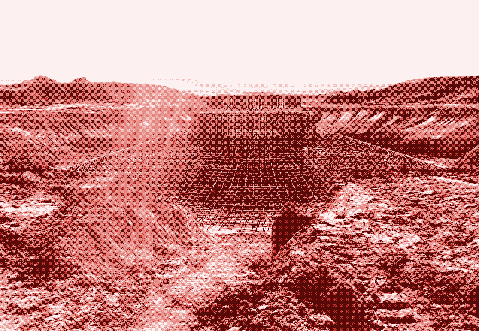

## INTRODUCTION

<br class="breakpage">

![[images/cover.jpg]]

![[images/cover.jpg|100x145]]

[[110.domestique]]

**[EFF](https://eff.org)**

```
**[EFF](https://eff.org)**
```

[[Programming in /#C, an introduction]]



==texte surligné==

~~texte barré~~

%%Ceci est un commentaire qui ne s'affiche pas%%

- [ ] Tâche à faire
- [x] Tâche terminée
- [>] Tâche reportée
- [!] Tâche importante

#design #eleventy #obsidian

> [!note] Titre
> Contenu de la note

> [!warning] Attention
> Message d'avertissement

> [!tip] Astuce
> Conseil utile


Notre environnement est saturé d’objets, d’images, et de mots. Le désencombrement apparaît comme une nécessité pour alléger nos espaces et nos modes de vie. Les objets remplissent nos foyers, certains nous paraissent essentiels et font partie intégrante de notre quotidien et de notre confort, d’autres sont chargés de souvenirs, et, beaucoup s’accumulent. 

Comment décider de ce que l’on garde et de ce que l’on laisse partir ? En quoi le design, initialement moteur de la production de masse, pourrait-il aujourd’hui devenir un levier pour repenser nos modes de consommation ? Comment favoriser la sobriété et tendre vers un modèle de décroissance ?

Ce mémoire explore les enjeux d’un désencombrement de notre société vis à vis des crises de tout ordre qu’elle traverse actuellement. Il s’agira de comprendre ce qui fait sens dans nos possessions, de questionner notre rapport à l’excès, d’envisager le désencombrement comme une démarche radicale mais, nécessaire. 
Désencombrer, c’est choisir ce qui est essentiel et refuser ce qui ne l’est pas. Il s’agit d’un processus actif qui invite à la réflexion sur nos besoins réels et sur les systèmes de production et de consommation qui façonnent notre quotidien.

Au début de chacun de mes projets, je commence par une carte heuristique. Un mot ou un concept central me sert de point de départ, autour duquel j’explore de manière intuitive une constellation de notions associées. J’ai suivi cette méthode pour le mot : Désencombrement. 
De là, de nombreux termes ont émergé, certains liés à des objets (bijoux, siège, skate, vélo), d’autres à des gestes (hériter, réparer), ou des notions (alternative, domestique, low-tech). Je les ai ensuite triés, sélectionnés, puis nourris avec des lectures, des images, des études de cas… 

J’ai toujours été sensible aux outils de savoir qui laissent place à la navigation personnelle comme les dictionnaires, les index les atlas… Ils permettent une navigation non linéaire, où l’on saute d’un mot à un autre au gré de nos curiosités, traçant nos propres parcours de lecture. C’est dans cette logique que l’index s’est révélé comme la forme la plus juste pour ce mémoire. L’index devrait pouvoir aussi refléter mon processus de pensée fragmentaire, associatif et organique.

Face à la complexité du monde et à l’impossibilité de tout saisir, il faudrait savoir choisir où porter son attention, comme on choisit de garder certains objets et de se séparer d’autres. L’index permet ce tri, il trace un parcours de lecture situé et assumé comme partiel, mais porteur de sens. 

Ce travail de réflexion s’est également articulé avec l’usage d’un outil numérique adapté à ma méthode de travail : Obsidian. Ce logiciel open source permet de prendre des notes de façon très souple, en créant des liens entre elles. Il s’inspire de la méthode Zettelkasten, une technique inventée par le sociologue Niklas Luhmann où chaque note est comme une petite fiche que l’on relie à d’autres et qui forment peu à peu un réseau d’idées interconnectées. Cela m’a permis de faire émerger des connexions inattendues, d’organiser mes idées de manières vivante et évolutive, à l’image du désencombrement, qui demande de voir autrement ce qui nous entoure.

Cette réflexion se prolonge dans la mise en forme du mémoire. J’expérimente avec *HTML to print*^[ **_HTML to Print_** : désigne les techniques permettant de transformer une page web en document imprimable ou exportable en PDF], un outil qui repense l’édition traditionnelle. Cette approche graphique rejoint l’idée du désencombrement : alléger la mise en page pour mieux guider la lecture, privilégier une structure claire et modulable, créer à partir d’outils *open source*. 

Ce mémoire est ainsi une double exploration : celle du désencombrement des objets, dans ses implications sociales, écologiques et philosophiques, et celle de la mise en forme de ce travail.

::: modularGrid {style="--grid-col:12; --grid-col-gutter:3mm; --grid-row:22; --grid-row-gutter:0mm;"}

(imagegrid: content/images/intro_domestique.png printcol:1 printwidth:12 printrow:1 printheight:8 imgX:-3.13419325639285 imgY:-0.3821281599059374 imgW:106.41547861507128 class: resizable caption: "Scan de carnet d’étude, *carte heuristique : domestique*, <br> Valentine Saint-Martin, octobre 2025")

(imagegrid: content/images/intro_heritage.png printcol:1 printwidth:12 printrow:11 printheight:8 imgX:3.7225616655351876 imgY:-2.281089036055926 imgW:103.1907671418873 class: resizable caption: "Scan de carnet d'étude, *carte heuristique : héritage*, <br>Valentine Saint-Martin, octobre 2025")
:::

::: modularGrid {style="--grid-col:12; --grid-col-gutter:3mm; --grid-row:22; --grid-row-gutter:0mm;"}

(imagegrid: content/images/intro_objet.png printcol:1 printwidth:12 printrow:1 printheight:14 imgX:-0.7694048427245986 imgY:-0.7368900091017321 imgW:100.61099796334013 class: resizable caption: "Scan de carnet d'étude, carte heuristique, Valentine Saint-Martin, octobre 2025")

:::

::: modularGrid {style="--grid-col:12; --grid-col-gutter:3mm; --grid-row:22; --grid-row-gutter:0mm;"}

(imagegrid: content/images/intro0.png printcol:1 printwidth:12 printrow:1 printheight:12 imgX:-0.1584068793844761 imgY:-0.9259259259259288 imgW:100.61099796334013 class: resizable caption: "Capture d'écran de la vue graphique du coffre Obsidian mémoire_valentine, juin 2025")

:::